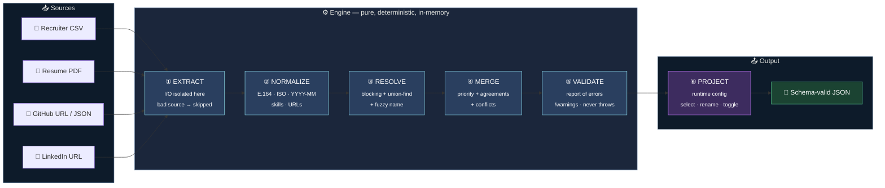
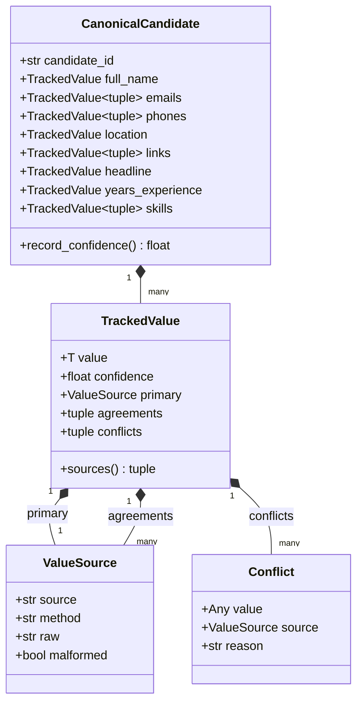
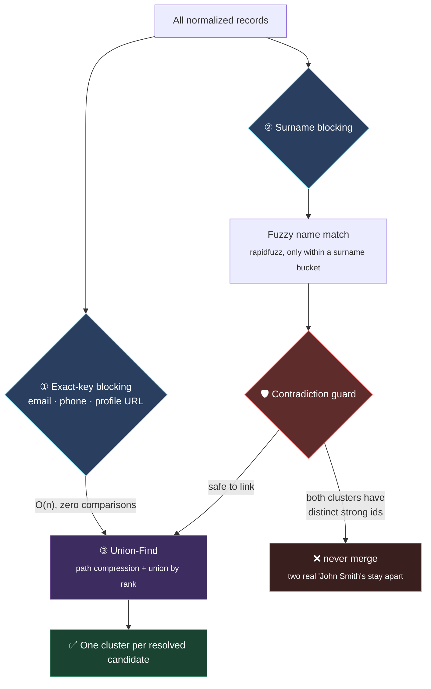
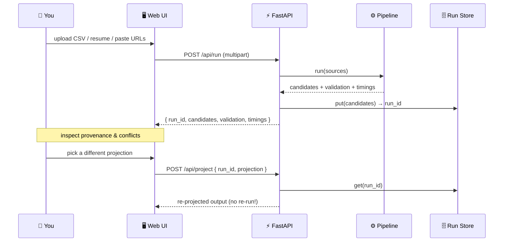

<div align="center">

# 🧬 Candidate Data Transformation Engine

### *Many messy sources in. One clean, explainable, trustworthy profile out.*

<br/>

[](https://www.python.org/)
[](https://docs.pydantic.dev/)
[](https://fastapi.tiangolo.com/)
[](#-tests--benchmark)
[](#-out-of-scope)

<br/>

### 🌐 How to run- Web UI + REST API

```bash
python -m uvicorn src.api.app:app          # then open http://127.0.0.1:8000
```
```bash
cd frontend
npm run dev                                # then open http://localhost:5173
```
## 🎥 Demo Video

[](https://drive.google.com/file/d/1IHl_6WbebPU8REyEFb0fIDU1LyG1ePDC/view?usp=drivesdk)

```
   📄 CSV ─┐
   📑 PDF ─┤
  🐙 GitHub┼──▶ ✦  ONE CANONICAL PROFILE PER CANDIDATE  ✦ ──▶ 🎯 any output schema
  💼 LinkedIn┤        every field traceable to its source
   📝 Notes─┘
```

<sub>Wrong-but-confident is worse than honestly-empty. This engine refuses to invent.</sub>

</div>

---

## 📌 Table of Contents

| | | |
|---|---|---|
| [🎯 The Problem](#-the-problem) | [✨ Highlights](#-highlights) | [🏗️ Architecture](#️-architecture-the-pipeline) |
| [🔬 The `TrackedValue` Atom](#-the-core-idea--the-trackedvalue-atom) | [🧠 How Stages Work](#-how-each-stage-works) | [⚙️ Configurable Output](#️-configurable-output--projection) |
| [🚀 Quickstart](#-quickstart) | [🖥️ CLI & API](#️-cli--web-api) | [📂 Project Layout](#-project-layout) |
| [➕ Extending](#-adding-a-new-source) | [🧪 Tests & Benchmark](#-tests--benchmark) | [🛡️ Design Principles](#️-design-principles-enforced-as-tests) |

---

## 🎯 The Problem

> Candidate information arrives from **many places at once**. Downstream products need **one clean, canonical profile per candidate**: a fixed set of fields, normalized formats, deduplicated across sources — *and a record of where each value came from and how confident we are in it.*

The hard part isn't reading files. It's the **conflicts**: two sources disagree on a name, a phone is malformed, the same person appears three times under two spellings. A bad value silently pollutes hiring decisions. So this engine treats **provenance and confidence as first-class data**, attached to every single value — never bolted on at the end.

<table>
<tr>
<td width="50%" valign="top">

**❌ The naive approach**

```
canonical_profile = { name, email, ... }
provenance_table  = { name: "CSV", ... }   # side table
confidence_table  = { name: 0.8, ... }     # another one
```
*Three structures that drift out of sync the moment merge logic gets non-trivial.*

</td>
<td width="50%" valign="top">

**✅ This engine**

```
full_name = TrackedValue(
    value="Jane Doe", confidence=0.85,
    primary=ValueSource("Resume", ...),
    agreements=[CSV], conflicts=[GitHub→…]
)
```
*Provenance and confidence **travel with the value** through every stage.*

</td>
</tr>
</table>

---

## ✨ Highlights

| 🧩 Capability | What it means |
|---|---|
| 🔌 **Pluggable extractors** | CSV (structured) + Resume PDF, GitHub, LinkedIn (unstructured). A new source = *new class + one line.* |
| 🧹 **Smart normalization** | Phones → **E.164**, countries → **ISO-3166 alpha-2**, dates → **`YYYY-MM`**, skills → canonical names, URLs canonicalized with the **handle parsed out** (`github.com/jane` → `jane`). |
| 🧠 **Entity resolution** | Exact email/phone **blocking** + **union-find** + surname-blocked **fuzzy name** matching — with a **contradiction guard** so two different "John Smith"s never glue together. |
| ⚖️ **Deterministic merge** | Priority picks the winner, agreements raise confidence, conflicts are *recorded with a reason* and lower it. Never random. |
| 🔎 **Full explainability** | Every output value traces back to its source(s) + method, plus the losing values and why they lost. |
| 🎛️ **Runtime-configurable output** | A YAML/JSON config reshapes the output — select, rename, normalize, toggle confidence/provenance, choose missing-value policy. **Same engine, zero code changes.** |
| 🛡️ **Robust by design** | A missing or garbage source yields *fewer* fields — **never a crash.** Unknown values become null, never invented. |
| 🔁 **Deterministic** | Same inputs → byte-identical output. A test runs the pipeline twice and diffs. |

---

## 🏗️ Architecture: The Pipeline

The whole engine is one mostly-pure function: `extract → normalize → resolve → merge → validate → project`. **File I/O lives only in extractors**; everything after is in-memory and deterministic.



Each stage carries a strict type contract, so the boundaries can't blur:

```
RawSource ──[extract]──▶ list[IntermediateRecord]   (loose, raw strings)
                    ──[normalize]──▶ list[NormalizedRecord]   (typed + ValueSource)
                       ──[resolve]──▶ list[Cluster]   (records grouped per person)
                          ──[merge]──▶ list[CanonicalCandidate]   (frozen, tracked)
                             ──[validate]──▶ list[ValidationReport]
                                ──[project]──▶ list[dict]   (your schema)
```

---

## 🔬 The Core Idea — the `TrackedValue` Atom

> Everything in this system flows from **one decision: how a single field value is represented.**

Instead of a canonical object *plus* parallel provenance/confidence tables, **the tracked value is the atom**, and a candidate is a *tree* of tracked values. This turns four of the five design principles from manual effort into **structural guarantees**.



**Why it's powerful**

| Property | How `TrackedValue` makes it *free* |
|---|---|
| 🧾 **Provenance** | Already attached to every value — no side table to keep in sync. |
| 📊 **Confidence** | Rides along and is adjusted in place during merge. |
| 🧊 **Immutability** | `frozen=True` → projection literally *cannot* mutate canonical data. |
| 🎯 **Determinism** | Sort `agreements`/`conflicts` by a stable key — the only discipline needed. |

---

## 🧠 How Each Stage Works

### ② Normalization — messy in, canonical out

Each field is dispatched to its own normalizer. A value that can't be fully parsed is **kept and flagged `malformed`** (driving a confidence penalty) rather than silently dropped — *"we record that we couldn't normalize it."*

| Field | Raw input | Canonical output |
|---|---|---|
| 📞 Phone | `9876543210` | `+919876543210` (E.164) |
| 🌍 Country | `India` | `IN` (ISO-3166 alpha-2) |
| 🗓️ Date | `Jan 2024` | `2024-01` (`YYYY-MM`) |
| 🛠️ Skill | `reactjs` | `React` (canonical alias) |
| 📧 Email | `Jane.Doe@Gmail.com` | `jane.doe@gmail.com` |
| 🔗 Link | `https://github.com/Jane/` | `github.com/jane` + handle `jane` |

### ③ Entity Resolution — who is who?

Efficient *by construction* — no all-pairs comparison:



### ④ Merge & Confidence — picking a trustworthy winner

**Priority** decides *who wins*; **confidence** describes *how sure we are* — two separate axes. A high-priority source can still score low confidence if its extraction was malformed.

```
Winner  = max by ( source priority, completeness, stable lexicographic tiebreak )   ← never random
Agreement (+0.05)  ·  Conflict (−0.10)  ·  Malformed (−0.20)        confidence ∈ [0, 1]
```

| Source | Priority | Base confidence |
|---|:---:|:---:|
| 📑 Resume | `90` | `0.90` |
| 🗂️ ATS | `85` | `0.85` |
| 📄 CSV | `80` | `0.80` |
| 🐙 GitHub | `70` | `0.70` |
| ❓ Unknown | `50` | `0.50` |

> Losing values aren't discarded — they're stored as `Conflict`s with a `reason` (`lower_source_priority`, `less_complete`, `tiebreak_lost`), so every resolution is fully auditable.

### ⑤ Validation — *valid with warnings, never throws*

Rule-based on purpose (Pydantic aborts on the first error and has no "warning" concept). Checks email & E.164 format, confidence range, ISO country code, `YYYY-MM` dates, duplicates, presence of an id, and flags any kept-but-malformed value. `is_valid` means *no error-level issues*.

---

## ⚙️ Configurable Output — Projection

The default schema is just a starting point. A runtime config reshapes the output — **a new output format is *data*, not code.** The projection layer only *reads* the frozen canonical record and builds a brand-new dict.

```yaml
# samples/projection_ats.yaml
name: "ATS Export v1"
include_confidence: true
include_provenance: false
missing_value_policy: omit          # omit | null | empty_string
fields:
  - { canonical: full_name,          out: candidateName }
  - { canonical: "emails[0]",        out: primaryEmail }   # index a collection
  - { canonical: "phones[0]",        out: primaryPhone }
  - { canonical: skills,             out: skillSet }        # whole collection → list
  - { canonical: years_experience,   out: yoe }
  - { canonical: "location.country", out: country }         # dig into nested value
  - { canonical: headline,           out: title }
```

<details>
<summary><b>📦 Produces this (click to expand)</b></summary>

```json
[
  {
    "candidateName": { "value": "Jane Doe",            "confidence": 0.8 },
    "primaryEmail":  { "value": "jane.doe@gmail.com",  "confidence": 0.8 },
    "primaryPhone":  { "value": "+919876543210",       "confidence": 0.8 },
    "country":       { "value": "IN",                  "confidence": 0.8 },
    "title":         { "value": "Senior ML Engineer",  "confidence": 0.8 },
    "yoe":           { "value": 6.0,                   "confidence": 0.8 },
    "skillSet": [
      { "value": "Machine Learning", "confidence": 0.8 },
      { "value": "Python",           "confidence": 0.8 },
      { "value": "React",            "confidence": 0.8 }
    ]
  }
]
```

</details>

**Path mini-syntax:** `full_name` (scalar) · `emails[0]` (one element) · `skills` (whole collection) · `location.country` (nested attribute) · `emails[0].value` (index + nested).

---

## 🚀 Quickstart

> Requires **Python 3.11+**

```bash
# install (editable, with API + dev extras)
python -m pip install -e ".[api,dev]"
```

---


One process serves the REST API **and** a minimal single-page UI. Upload a CSV and/or resume, expand any field in the **Canonical Inspector** to see its winning source, agreements, and the conflicts that lost — then re-project live *without re-running the pipeline*.



| Endpoint | Purpose |
|---|---|
| `POST /api/run` | multipart upload (`csv`/`resume`/`github`/`linkedin`) → `{ run_id, candidates, validation, timings }` |
| `POST /api/project` | `{ run_id, projection_id \| projection }` → projected output |
| `GET /api/projections` | available saved projection configs |
| `GET /api/health` | liveness probe |

---

## 📂 Project Layout

```
src/
├── 🧱 models/        TrackedValue (the provenance atom), canonical model, config, stats
├── 🔌 extractors/    registry + CSV (streaming) · resume-PDF · GitHub · LinkedIn
├── 🧹 normalizers/   per-field normalizers + dispatch engine + skill-alias data
├── 🧠 resolution/    entity resolution: blocking + union-find + fuzzy name
├── ⚖️ merger/        deterministic per-field merge
├── 📊 confidence/    confidence scoring (the single source of truth)
├── ✅ validators/    rule-based validation report (never throws)
├── 🎛️ projection/    config-driven projection engine + YAML/JSON loader
├── 🔗 pipeline.py    composes the stages; records per-stage timings
├── 💻 cli.py         command-line entry point
└── ⚡ api/           thin FastAPI shell over the pure pipeline + in-memory run store
web/                  minimal single-page UI (plain HTML / CSS / JS)
samples/              example CSV · resume PDF · GitHub JSON · projection configs
dataset/              10 CSV edge-case files · resumes · JSON fixtures
scripts/              sample-resume generator · scaling benchmark
tests/                68 tests
docs/DESIGN.md        the full engineering design document
```

---

## ➕ Adding a New Source

The pipeline is built so a new source is **a new class plus one registration line** — no existing module changes:

```python
from .base import Extractor, register

@register("my_source")                       # ← the one line that wires it in
class MyExtractor(Extractor):
    source_label = "MySource"
    def extract(self, path):
        ...                                  # yield IntermediateRecords (never raise)
```

That's it — normalization, resolution, merge, validation, and projection all pick it up automatically.

---

## 🧪 Tests & Benchmark

```bash
python -m pytest -q                # 68 tests
python scripts/benchmark.py        # scaling demo (near-linear resolution)
```

The benchmark generates synthetic candidates and times each stage across growing **N**. Because resolution uses **blocking + union-find** instead of all-pairs comparison, **resolve µs-per-record stays roughly flat** as N grows:

```
        resolve time per record
   µs   │
        │  ●─────●─────●─────●          ← this engine  (near-linear total)
        │                       ╱
        │                    ╱          ← an O(n²) all-pairs resolver
        │                 ╱                (~4× per doubling of N)
        └──────────────────────────▶  N
          1k    4k    16k   64k
```

```bash
python scripts/benchmark.py --sizes 1000 4000 16000 64000
```

---

## 🛡️ Design Principles (enforced as tests)

> The five principles are only useful if they're *enforceable*. Each maps to a concrete, tested invariant.

| Principle | Invariant | How it's enforced |
|---|---|---|
| 🚫 **Never invent** | No field is populated without a source | Every value is a `TrackedValue`; "unknown" is a real, representable state |
| 🔎 **Explainable** | Every value traces to ≥1 source + method | Provenance carried *by* the value, not a side table |
| 🧊 **Canonical is immutable** | Projection can't mutate canonical data | `frozen` dataclasses; projection only reads and returns a new dict |
| 🎯 **Deterministic** | `pipeline(x) == pipeline(x)` byte-for-byte | Stable sorting everywhere + a test that runs twice and diffs |
| 🧩 **One responsibility** | Each stage is `f(in) → out`, no hidden state | Pure functions; I/O isolated to extractors |

> 💬 **The one-liner:** *"I made the provenance-carrying value the fundamental unit instead of bolting provenance on at the end. That turned four of the five design principles from manual effort into structural guarantees."*

---

## 🚧 Out of Scope

Intentionally excluded to keep the focus on a *defensible core*: authentication, databases / persistence, OCR, distributed systems, real-time streaming, ML-based entity resolution, and production deployment.

---

<div align="center">

### 🧭 Where to go next

**📖 Full engineering rationale & design decisions →** [`docs/DESIGN.md`](docs/DESIGN.md)

<sub>Built for correctness, explainability, determinism, and extensibility — not for flash.</sub>

<br/>

**⭐ Same inputs, same output, every time — and every value knows where it came from.**

</div>
